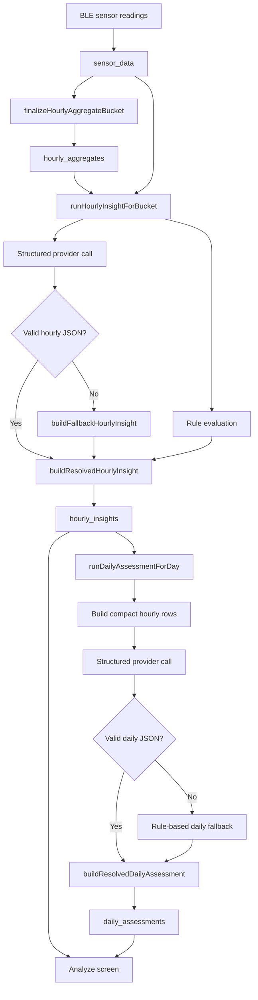
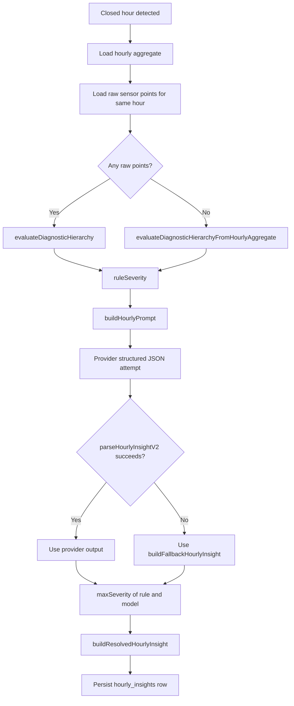
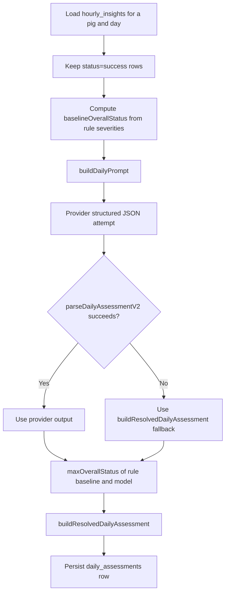
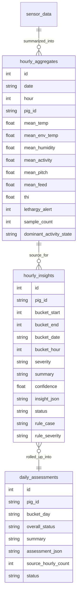

# Deterministic Insights

This document describes how hourly and daily insights work in PigFit today.

It covers:
- where the insight fields come from
- how hourly and daily outputs are produced
- what the UI actually renders
- known gaps found during review

## Scope

Relevant files:
- `services/ai/deterministic/contracts.ts`
- `services/ai/deterministic/promptBuilder.ts`
- `services/ai/deterministic/orchestrator.ts`
- `services/ingestion/sensorIngestService.ts`
- `screens/Analyze.tsx`
- `services/storage/db/client.ts`

## High-Level Flow



## Hourly Insight Schema

Defined in `HourlyInsightV2` in `contracts.ts`.

```ts
{
  schema_version: 'hourly_insight_v2',
  severity: 'normal' | 'warning' | 'critical',
  summary: string,
  confidence: number,
  probable_issue: string,
  key_evidence: string[],
  differential_considerations: string[],
  immediate_actions: string[],
  escalation_triggers: string[],
  uncertainty_notes: string[]
}
```

### What each field means

- `schema_version`: output version tag.
- `severity`: hour-level health severity.
- `summary`: short natural-language summary for the hour.
- `confidence`: bounded to `0..1`.
- `probable_issue`: primary interpretation of the hour.
- `key_evidence`: concrete measurements and rule evidence.
- `differential_considerations`: plausible alternate explanations.
- `immediate_actions`: what the operator should do now.
- `escalation_triggers`: when to escalate or call a vet.
- `uncertainty_notes`: why confidence may be weaker.

## Daily Assessment Schema

Defined in `DailyAssessmentV2` in `contracts.ts`.

```ts
{
  schema_version: 'daily_assessment_v2',
  overall_status: 'normal' | 'watch' | 'critical',
  summary: string,
  confidence: number,
  probable_issue: string,
  key_evidence: string[],
  differential_considerations: string[],
  immediate_actions: string[],
  monitor_next_24h: string[],
  escalation_triggers: string[],
  uncertainty_notes: string[]
}
```

### What each field means

- `schema_version`: output version tag.
- `overall_status`: day-level rollup status.
- `summary`: short day summary.
- `confidence`: bounded to `0..1`.
- `probable_issue`: main day-level concern.
- `key_evidence`: the strongest evidence used to justify the day summary.
- `differential_considerations`: alternative explanations for the pattern.
- `immediate_actions`: actions to take now based on the day.
- `monitor_next_24h`: things to watch going forward.
- `escalation_triggers`: when the daily pattern warrants escalation.
- `uncertainty_notes`: reasons the day summary may be less reliable.

## Hourly Generation Logic



### Hourly source inputs

The hourly pipeline uses:
- `mean_temp`
- `mean_env_temp`
- `mean_humidity`
- `mean_activity`
- `mean_pitch`
- `mean_feed`
- `sample_count`
- `thi`
- `lethargy_alert`
- `dominant_activity_state`
- rule metadata from the decision tree

### Hourly fallback behavior

If the provider fails or returns invalid JSON, the app still generates an hourly insight locally.

Current local fallback thresholds:
- `critical` if `thi >= 84`
- `critical` if `thi >= 79` and `lethargy_alert = 1`
- `warning` if `thi >= 79`
- `warning` if `lethargy_alert = 1`
- otherwise `normal`

## Daily Generation Logic



### Daily rollup rule

The baseline status comes from the strongest hourly rule severity:
- any hourly `critical` rule => daily `critical`
- else any hourly `warning` rule => daily `watch`
- else daily `normal`

This is important: the model cannot reduce the daily status below the rule baseline.

## What the UI Actually Shows

The `Analyze` screen does not render the full stored schema.

It converts raw JSON into this reduced card shape:

```ts
{
  status,
  confidence,
  probableIssue,
  evidence,
  actions,
  escalation
}
```

### Fields shown on the cards

- title
- status badge
- confidence
- probable issue
- top evidence
- actions
- escalation

### Fields currently not shown on the cards

- `differential_considerations`
- `uncertainty_notes`
- `monitor_next_24h` for daily assessments

That means some of the clinically useful output is being stored but not surfaced in the current UI.

## Storage Model



## Review Findings

### 1. Daily generation threshold is inconsistent across the app

The UI in `Analyze.tsx` requires at least `8` successful hourly insights before the user can manually generate a daily assessment.

But `runDailyAssessmentForDay` will generate a daily assessment as long as there is at least `1` successful hourly insight, and `backfillDeterministicInsightsV2` calls it for every day it processes.

Impact:
- the stored data can contain daily assessments that the UI says should not exist yet
- confidence and uncertainty messaging may not align with operator expectations

### 2. Daily evidence can miss the hour that actually caused the daily severity

`buildDailyEvidence()` counts critical and warning hours correctly, but the evidence details are taken from only the latest two hours by `bucket_hour` descending.

Impact:
- a day can be marked `critical` because of an early critical hour
- the visible evidence can mention only later non-critical hours
- operators may see a severe daily status without the strongest supporting example

### 3. Important stored fields are not surfaced in the current UI

The system stores:
- hourly `differential_considerations`
- hourly `uncertainty_notes`
- daily `differential_considerations`
- daily `monitor_next_24h`
- daily `uncertainty_notes`

But the current card renderer only shows:
- evidence
- actions
- escalation

Impact:
- the model produces richer clinical context than the app presents
- operators lose visibility into uncertainty and next-day watch items

## Recommended Improvements

- Enforce the same minimum-hour threshold in `runDailyAssessmentForDay` that the UI enforces.
- Change daily evidence selection to include the highest-severity hour first, not only the latest two hours.
- Extend the daily UI card to show `monitor_next_24h`.
- Consider exposing `uncertainty_notes` in both hourly and daily cards when confidence is reduced.

## Example Mental Model

Use the insights in this order:

1. `severity` or `overall_status` tells you how urgent the situation is.
2. `probable_issue` tells you the main interpretation.
3. `key_evidence` tells you why the system thinks that.
4. `immediate_actions` tells you what to do now.
5. `escalation_triggers` tells you when the case moves beyond routine monitoring.
6. `uncertainty_notes` tells you how cautious you should be about over-trusting the output.

## Current Design Intent

The system is built to be conservative:
- rule-based severity acts as a floor
- provider output can enrich wording and evidence
- provider output is not allowed to downgrade below rule severity
- local fallbacks keep the pipeline usable even when provider calls fail

That is a sound design choice for a health-monitoring workflow, but the daily evidence selection and threshold mismatch should be fixed to keep the explanation layer aligned with the severity layer.
